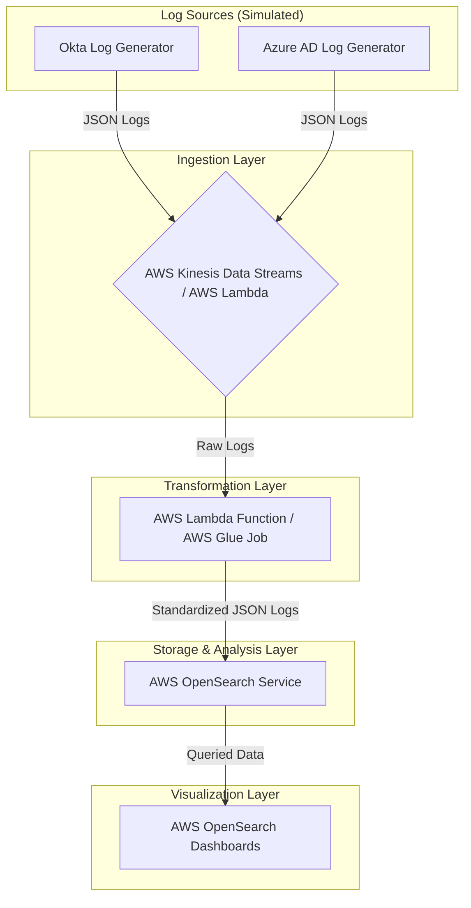

# SIEM Lake for Identity Logs - Proof of Concept (PoC)

This PoC demonstrates a simplified SIEM (Security Information and Event Management) Lake built on AWS services. It focuses on ingesting, transforming, storing, and visualizing identity-related logs (specifically login failures) from multiple simulated application tenants and identity providers.

## Table of Contents

1.  [Architecture Overview](#architecture-overview)
2.  [Core Components](#core-components)
3.  [Prerequisites](#prerequisites)
4.  [Setup and Deployment](#setup-and-deployment)
    *   [Step 1: Configure AWS OpenSearch Service](#step-1-configure-aws-opensearch-service)
    *   [Step 2: Set Up Log Ingestion (AWS Kinesis/Lambda)](#step-2-set-up-log-ingestion-aws-kinesislambda)
    *   [Step 3: Deploy Transformation Logic (AWS Lambda)](#step-3-deploy-transformation-logic-aws-lambda)
    *   [Step 4: Apply OpenSearch Index Template](#step-4-apply-opensearch-index-template)
5.  [Simulating and Ingesting Logs](#simulating-and-ingesting-logs)
    *   [Running the Sample Log Generator](#running-the-sample-log-generator)
    *   [Sending Logs to Ingestion Endpoint](#sending-logs-to-ingestion-endpoint)
6.  [Querying Logs in OpenSearch](#querying-logs-in-opensearch)
7.  [Setting Up the Dashboard](#setting-up-the-dashboard)
8.  [Testing and Validation](#testing-and-validation)
9.  [Scaling the Solution](#scaling-the-solution)
10. [Security Considerations](#security-considerations)
11. [Artifacts Included](#artifacts-included)

## 1. Architecture Overview

The system follows this general flow:



*   **Simulated Log Sources:** Python scripts generate logs mimicking Okta and Azure AD.
*   **Ingestion:** AWS Kinesis Data Streams (recommended for streaming) or a Lambda function (for batch/simpler setups) ingests these logs.
*   **Transformation:** An AWS Lambda function (or AWS Glue for larger/complex ETL) parses heterogeneous logs and maps them to a standardized schema.
*   **Storage:** Transformed logs are stored in AWS OpenSearch Service for efficient querying and analysis.
*   **Visualization:** AWS OpenSearch Dashboards provide visualizations for login failure insights.

Refer to `architecture_diagram.md` for more details.

## 2. Core Components

*   **`sample_log_generator.py`**: Python script to simulate identity logs.
*   **`transformation_lambda.py`**: Python script for the AWS Lambda function that transforms logs.
*   **`opensearch_index_template.json`**: JSON defining the OpenSearch index mapping and settings for identity logs.
*   **`sample_opensearch_query.json`**: Sample OpenSearch Query DSL for fetching login failure data.
*   **`dashboard_configuration.md`**: Markdown file describing the setup of the OpenSearch Dashboard.

## 3. Prerequisites

*   AWS Account with permissions to create and manage:
    *   AWS OpenSearch Service (and OpenSearch Dashboards)
    *   AWS Lambda
    *   AWS Kinesis Data Streams (optional, if used for ingestion)
    *   AWS Kinesis Data Firehose (often used with Kinesis Data Streams to batch data to S3 or OpenSearch, with Lambda for transformation)
    *   IAM Roles and Policies
*   Python 3.x installed locally for running the log generator.
*   AWS CLI configured (optional, for deployment and management).
*   Access to OpenSearch Dashboards endpoint.

## 4. Setup and Deployment

These are high-level steps. Refer to AWS documentation for detailed instructions on creating and configuring these services.

### Step 1: Configure AWS OpenSearch Service

1.  **Create an OpenSearch Domain:**
    *   Choose an appropriate domain name (e.g., `siem-poc-domain`).
    *   Select instance types and storage suitable for a PoC (e.g., `t3.small.search` for testing, ensure enough storage).
    *   Configure network access (VPC recommended for security).
    *   Set up fine-grained access control (FGAC):
        *   Create a master user.
        *   Define roles and map users for accessing OpenSearch and Dashboards.
    *   Enable encryption at rest and node-to-node encryption.
2.  **Access OpenSearch Dashboards:** Once the domain is active, note the OpenSearch Dashboards URL.

### Step 2: Set Up Log Ingestion (AWS Kinesis/Lambda)

**Option A: Kinesis Data Streams + Kinesis Data Firehose + Lambda (Recommended for streaming)**

1.  **Create Kinesis Data Stream:**
    *   Name: e.g., `identity-logs-raw-stream`.
    *   Configure shard count (1 for PoC is fine).
2.  **Create Kinesis Data Firehose Delivery Stream:**
    *   Source: The Kinesis Data Stream created above (`identity-logs-raw-stream`).
    *   **Transformation:** Enabled.
        *   Choose the Lambda function created in Step 3 (`transformation_lambda.py`).
    *   **Destination:** Your AWS OpenSearch Service domain.
        *   Index: `siem-identity-logs` (this will be the base name, the template uses `siem-identity-logs-*`). Note: OpenSearch Service destinations in Firehose typically require an index rotation setting (e.g. `EveryDay`). The index name here would be the prefix, so `siem-identity-logs` would result in indices like `siem-identity-logs-YYYY-MM-DD-HH`. The index template `siem-identity-logs-*` will match these.
        *   Retry duration, S3 backup settings as needed.
    *   Configure IAM roles with necessary permissions for Firehose to read from Kinesis, invoke Lambda, and write to OpenSearch and S3 (for backups).

**Option B: Direct Lambda Ingestion (Simpler for PoC if not testing streaming)**

1.  Create an API Gateway endpoint that triggers the `transformation_lambda.py` function. This is simpler for direct HTTP posts from the log generator but less robust than Kinesis.
2.  Alternatively, the `transformation_lambda.py` can be configured to write directly to OpenSearch if it's not part of a Firehose stream. This requires adding OpenSearch client logic to the Lambda. For this PoC, we assume Firehose handles the OpenSearch delivery after transformation.

### Step 3: Deploy Transformation Logic (AWS Lambda)

1.  **Create Lambda Function:**
    *   Name: e.g., `siem-log-transformer`.
    *   Runtime: Python 3.x (e.g., Python 3.9).
    *   Architecture: (e.g., x86_64).
2.  **Upload Code:** Package the `transformation_lambda.py` script (no external libraries are used in this basic version, so a direct upload or .zip is fine).
3.  **Handler:** Set to `transformation_lambda.lambda_handler`.
4.  **Permissions (IAM Role):**
    *   The Lambda execution role needs permissions to:
        *   Write logs to CloudWatch Logs.
        *   If Kinesis Firehose is used, Firehose will invoke this Lambda. The role used by Firehose needs `lambda:InvokeFunction` permission for this function.
5.  **Environment Variables (Optional):** If needed, configure any environment variables.
6.  **Timeout and Memory:** Adjust as necessary (e.g., 15 seconds, 256MB might be sufficient for this PoC). The default Kinesis Data Firehose Lambda invocation timeout is 3 minutes, but can be configured up to 5 minutes. Ensure your Lambda timeout is less than this.

### Step 4: Apply OpenSearch Index Template

1.  **Access OpenSearch Dashboards.**
2.  Navigate to **Dev Tools**.
3.  Paste the content of `opensearch_index_template.json` into the Dev Tools console and run it.
    ```json
    PUT _index_template/siem_identity_logs_template
    // Paste content of opensearch_index_template.json here
    ```
    Ensure the request is successful. This template will apply to new indices matching the pattern `siem-identity-logs-*`.
    (The UI method described previously under Stack Management is also valid).

## 5. Simulating and Ingesting Logs

### Running the Sample Log Generator

The `sample_log_generator.py` script generates logs and prints them to the console.

```bash
python sample_log_generator.py
```

Each log from the generator is a JSON object containing a `provider` field (`okta` or `azure_ad`) and a `log` field with the actual log data.

### Sending Logs to Ingestion Endpoint

How logs are sent depends on your ingestion setup:

*   **If using Kinesis Data Streams:**
    You'll need a mechanism to send the generated logs to your Kinesis Data Stream. The AWS SDK (e.g., Boto3 in Python) can be used. Modify `sample_log_generator.py` to put records into Kinesis.
    Example snippet for Boto3 (add to `sample_log_generator.py`):
    ```python
    # import boto3
    # import json # Ensure json is imported
    # kinesis_client = boto3.client('kinesis', region_name='your-region') # Replace 'your-region'
    # stream_name = 'identity-logs-raw-stream' # Replace with your stream name
    # ... inside the loop after generating log_entry ...
    # # For Okta:
    # # provider_log = {"provider": "okta", "log": log_entry}
    # # For Azure AD:
    # # provider_log = {"provider": "azure_ad", "log": log_entry}
    #
    # # Determine partition key - using tenant_id is a good practice
    # partition_key_value = "default_partition_key"
    # if "tenant_id_source" in log_entry: # Okta
    #     partition_key_value = log_entry["tenant_id_source"]
    # elif "tenantContextId" in log_entry: # Azure AD
    #     partition_key_value = log_entry["tenantContextId"]
    #
    # print(f"Sending to Kinesis: {json.dumps(provider_log)}")
    # kinesis_client.put_record(
    #     StreamName=stream_name,
    #     Data=json.dumps(provider_log), # The transformation lambda expects provider and log keys
    #     PartitionKey=partition_key_value
    # )
    ```
    Uncomment and adapt the section in `sample_log_generator.py` that calls `main()` to include this Kinesis sending logic.

*   **If using direct Lambda with API Gateway:**
    Modify the script to POST each log (as `{"provider": "xxx", "log": {...}}`) to the API Gateway endpoint.

For this PoC, you can manually copy-paste a few generated logs or modify the script to send them. Ensure the logs are sent in the format expected by `transformation_lambda.py` (i.e., with `provider` and `log` keys).

## 6. Querying Logs in OpenSearch

1.  In OpenSearch Dashboards, go to **Dev Tools**.
2.  You can use the `sample_opensearch_query.json` to query your `siem-identity-logs-*` indices.
    Example:
    ```json
    GET siem-identity-logs-*/_search
    // Paste content of sample_opensearch_query.json here
    ```
3.  Verify that the query returns aggregations as expected. You should see documents if ingestion was successful.

## 7. Setting Up the Dashboard

Follow the instructions in `dashboard_configuration.md` to create visualizations and assemble them into a dashboard in OpenSearch Dashboards. This involves:
1.  Creating an index pattern (e.g., `siem-identity-logs-*`) in **Stack Management > Index Patterns** if not automatically created or if you need to refresh fields. Ensure the timestamp field is correctly identified (`timestamp`).
2.  Creating individual visualizations (bar charts, pie charts, line charts, tables) based on the new index pattern.
3.  Adding these visualizations to a new dashboard.
4.  Adding controls (e.g., for filtering by `tenant_id`).

## 8. Testing and Validation

*   **Ingestion:** Ensure logs sent from the generator appear in OpenSearch after transformation. Check Kinesis Firehose monitoring for delivery status and Lambda logs for transformation errors.
*   **Transformation:** Verify that fields are correctly mapped to the standardized schema in OpenSearch documents. Check `event_type` and `event_status` normalization.
*   **Tenant Isolation:** Use dashboard filters or direct queries (e.g., `q=tenant_id:tenant-alpha`) to check if data for a specific tenant can be isolated.
*   **Dashboard Accuracy:** Confirm that dashboard visualizations correctly reflect login failure data (e.g., counts, trends).
*   **Timestamps:** Ensure timestamps are correctly parsed and time-based queries/visualizations work as expected. The time filter in Dashboards should function correctly.

## 9. Scaling the Solution

*   **Kinesis Data Streams/Firehose:** Increase shard count for Kinesis Data Streams; Firehose scales automatically. Monitor and adjust Firehose buffer hints (size/time).
*   **Lambda:** Lambda scales automatically. Monitor concurrency limits and duration. For very high volumes or complex transformations, AWS Glue might be more suitable.
*   **OpenSearch Service:** Scale up or out by adding more nodes, choosing larger instance types, or optimizing shard strategy. Implement Index State Management (ISM) policies for managing data lifecycle (e.g., moving old data to cold storage, deleting it). The provided template includes placeholders for ISM (`index.lifecycle.name`, `index.lifecycle.rollover_alias`). You would need to create the actual ISM policy in OpenSearch.
*   **Log Volume:** The log generator can be modified to produce higher volumes for stress testing.

## 10. Security Considerations

*   **IAM Roles:** Use least privilege for all IAM roles (Lambda, Kinesis, OpenSearch access).
*   **Encryption:**
    *   Enable encryption at rest for OpenSearch.
    *   Enable node-to-node encryption for OpenSearch.
    *   Use HTTPS for all endpoints (Kinesis, API Gateway, OpenSearch Dashboards).
*   **Network Security:** Deploy OpenSearch and other resources within a VPC where possible. Use security groups and network ACLs to restrict access.
*   **OpenSearch Fine-Grained Access Control (FGAC):**
    *   Implement robust FGAC to control user access to indices, dashboards, and operations.
    *   Ensure tenant-specific access if direct tenant logins to Dashboards are required (more complex setup). For this PoC, a central security team might manage the dashboard.
*   **Data Masking/Tokenization:** For sensitive PII in logs, consider masking or tokenizing data during the transformation phase (not implemented in this PoC).
*   **Secure Log Transport:** Ensure logs are sent securely to the ingestion endpoint (e.g., via HTTPS to Kinesis or API Gateway).

## 11. Artifacts Included

*   `README.md`: This file.
*   `architecture_diagram.md`: Mermaid diagram of the system architecture.
*   `sample_log_generator.py`: Python script to simulate Okta and Azure AD logs.
*   `transformation_lambda.py`: Python script for the Lambda transformation logic.
*   `opensearch_index_template.json`: JSON for OpenSearch index template.
*   `sample_opensearch_query.json`: JSON for a sample OpenSearch query for login failures.
*   `dashboard_configuration.md`: Markdown describing the OpenSearch Dashboard setup.
*   `run_app.sh`: Script to orchestrate the entire PoC setup and log generation flow.
*   `terraform/`: Directory containing Terraform scripts for infrastructure deployment.
    *   `terraform/run.sh`: Helper script to manage Terraform deployment.

## End-to-End Automation with `run_app.sh`

For a streamlined experience, the `run_app.sh` script in the project root attempts to automate the entire process from infrastructure deployment to initiating log generation.

### Prerequisites for `run_app.sh`

*   All prerequisites listed in `terraform/README.md` (Terraform CLI, AWS CLI configured).
*   Python 3.x (for `sample_log_generator.py`).
*   **Boto3 Python library**: If you want `sample_log_generator.py` to automatically send logs to Kinesis. Install it using:
    ```bash
    pip install boto3
    ```
    If Boto3 is not installed, the generator will print logs to the console, and `run_app.sh` will provide instructions for manual piping.

### Using `run_app.sh`

1.  **Navigate to the project root directory** (the directory containing `run_app.sh` and the `terraform/` subdirectory).
2.  **Ensure `run_app.sh` is executable:**
    ```bash
    chmod +x run_app.sh
    ```
3.  **Configure Terraform Environment:**
    *   Go into the `terraform/` directory.
    *   Copy `terraform/.env.example` to `terraform/.env`.
    *   Edit `terraform/.env` with your specific AWS region, project name, and any OpenSearch master user credentials if desired.
    *   Return to the project root directory. The `run_app.sh` script expects to be run from here.

### To Deploy Infrastructure and Generate Initial Logs:

```bash
./run_app.sh
```
This script will:
1.  Perform pre-flight checks (Python, AWS CLI, required files).
2.  Execute `terraform/run.sh` to deploy the AWS infrastructure (this includes `terraform init`, `plan`, and prompting for `apply`).
3.  Retrieve the Kinesis Data Stream name and OpenSearch Dashboard URL from Terraform outputs.
4.  Run `sample_log_generator.py`, attempting to send logs directly to the Kinesis stream if Boto3 is available.
5.  Remind you of manual post-deployment steps (OpenSearch index template, dashboard setup).

### To Destroy Infrastructure:

```bash
./run_app.sh destroy
```
This will navigate to the `terraform/` directory and execute `terraform/run.sh destroy`, which then runs `terraform destroy`.

**Note:** Always review the output of the scripts carefully, especially the Terraform plan, before confirming actions that create or destroy resources.
```
