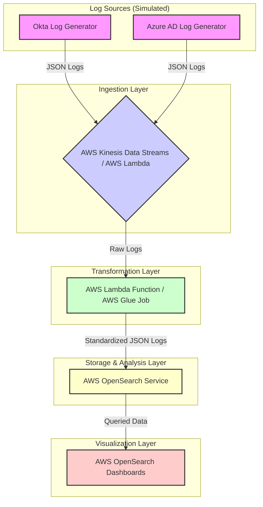

**Explanation of the Diagram:**

1.  **Log Sources (Simulated)**:
    *   `Okta Log Generator` and `Azure AD Log Generator`: Python scripts producing sample identity logs.

2.  **Ingestion Layer**:
    *   `AWS Kinesis Data Streams / AWS Lambda`: Receives raw logs. Kinesis for streaming, Lambda for batch/simpler setups.

3.  **Transformation Layer**:
    *   `AWS Lambda Function / AWS Glue Job`: Parses heterogeneous logs and transforms them into the standardized schema. Lambda for real-time/small batches, Glue for complex ETL/large batches.

4.  **Storage & Analysis Layer**:
    *   `AWS OpenSearch Service`: Stores transformed logs. An index with defined mapping is used. Provides Query DSL for analysis.

5.  **Visualization Layer**:
    *   `AWS OpenSearch Dashboards`: Creates and displays dashboards by querying OpenSearch.

**Data Flow:**

*   Simulated JSON logs from `Log Generators` go to the `Ingestion Layer`.
*   `Ingestion Layer` sends raw logs to the `Transformation Layer`.
*   `Transformation Layer` processes, standardizes, and sends `Standardized JSON Logs` to `AWS OpenSearch Service`.
*   `AWS OpenSearch Dashboards` queries `AWS OpenSearch Service` for data to display on dashboards.
